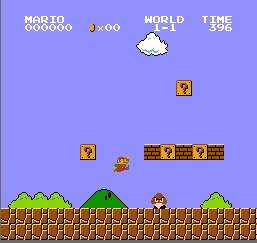
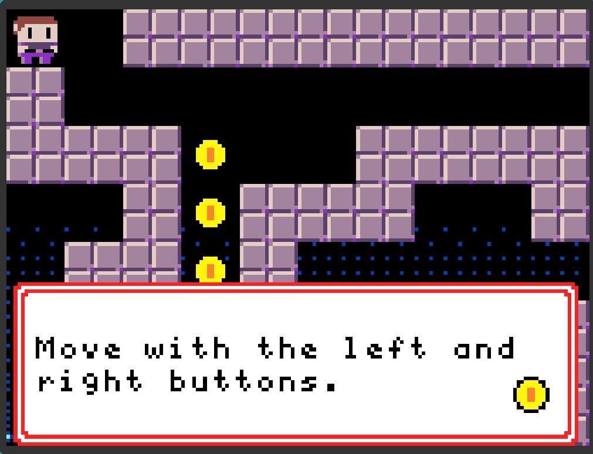
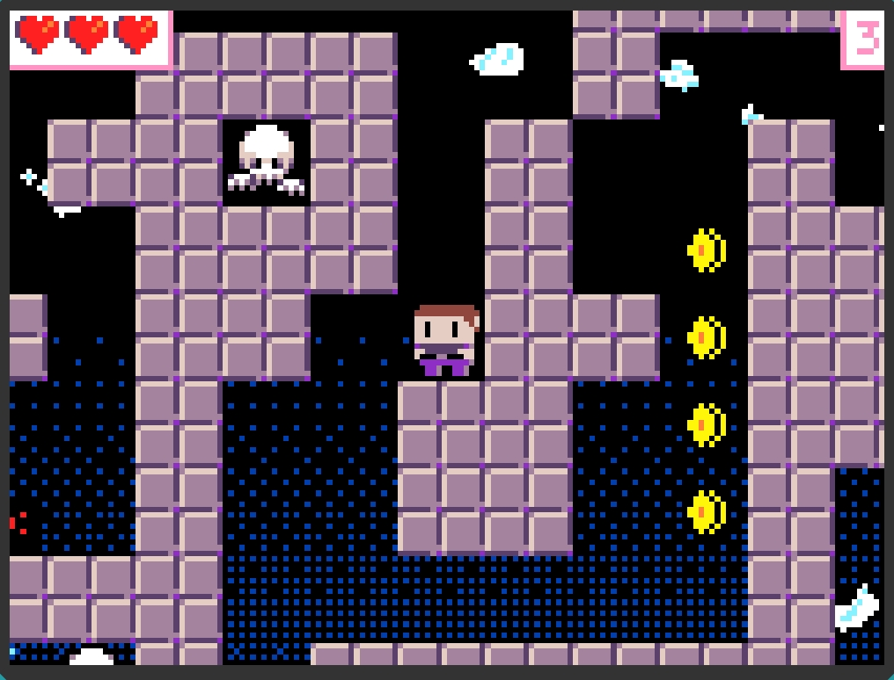
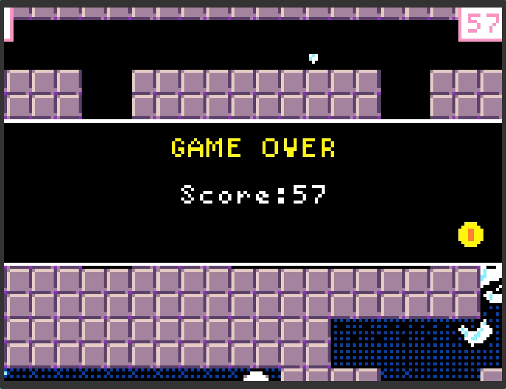
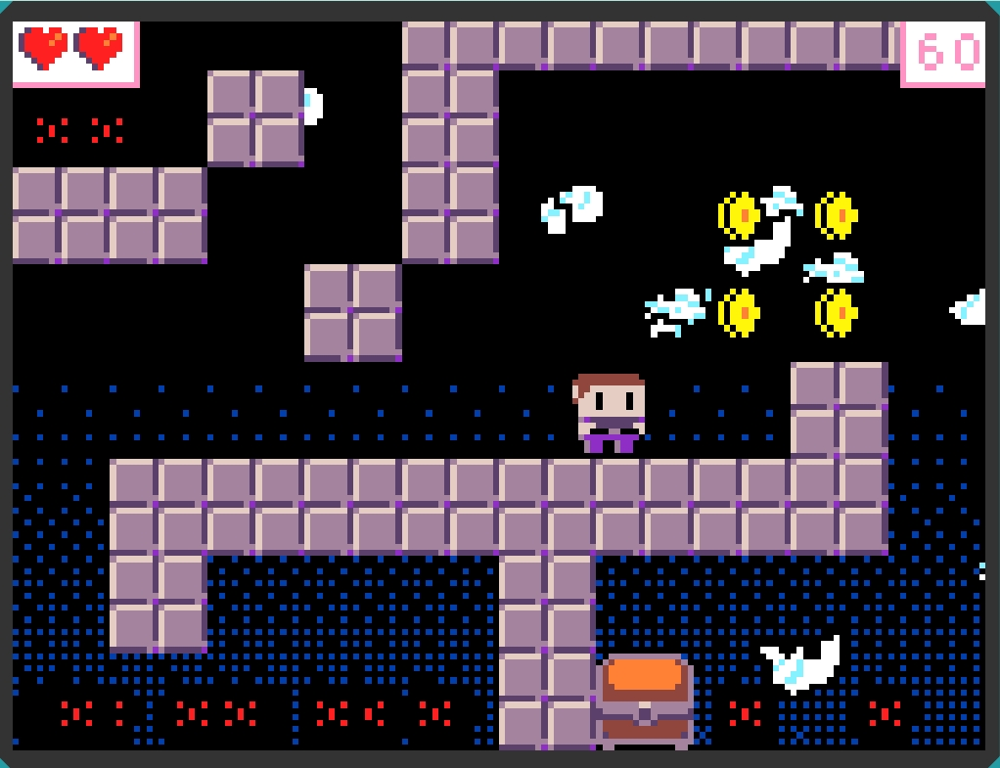
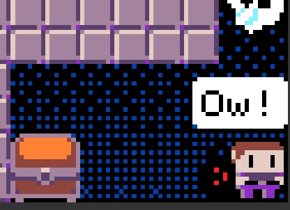

# Jumping Mazes Game
A pixel-art platformer game where players navigate maze-like levels, collect coins, avoid enemies, and find treasure chests to unlock the next level. Inspired by classic games like Super Mario, the game includes collectible items, enemy AI, and a double-jump mechanic for enhanced mobility.

## Table of Contents
* [General Info](#general-information)
* [Technologies Used](#technologies-used)
* [Features](#features)
* [Screenshots](#screenshots)
* [Setup](#setup)
* [Usage](#usage)
* [Project Status](#project-status)
* [Room for Improvement](#room-for-improvement)
* [Acknowledgements](#acknowledgements)
* [Contact](#contact)
<!-- * [License](#license) -->

## General Information
-Description: This is a retro-style pixel-art game where players control a character navigating through levels filled with coins, enemies, and obstacles. Players must reach a treasure chest hidden in each level to progress.
-Purpose: Designed as a fun and challenging platformer with familiar mechanics, such as double-jumping and avoiding patrolling enemies.
-Inspiration: Inspired by Super Mario, this game captures the nostalgic feel of classic platformers while introducing unique elements like enemy AI patrols and trap-triggering coins.
<!-- You don't have to answer all the questions - just the ones relevant to your project. -->

## Technologies Used
- MakeCode Arcade - for game development and visual scripting
- JavaScript - within MakeCode Arcade for game logic and mechanics

## Features
- Double-Jump Mechanic: Players can press jump twice to reach higher platforms, adding depth to the platforming experience.
- Enemy AI: Basic enemies patrol a designated path, and certain enemies switch to pursuit mode when the player enters their range.
- Collectibles & Traps: Coins boost the player’s score and serve as guides through the maze, but some may also lead to traps.
- Physics-Based Jumping: The game incorporates realistic gravity and momentum in its jumping mechanics, allowing players to perform precise jumps. The gravity setting adds a more natural feel to character movements.

## Screenshots

<!-- If you have screenshots you'd like to share, include them here. -->

## Setup
1.Download or clone the repository.
2.Open MakeCode Arcade and import the project files.
3.Ensure any required MakeCode Arcade extensions for sprites and animations are installed.

## Usage
Movement: Use arrow keys to move the character left or right.
Jumping: Press the jump key once or twice to navigate platforms and evade enemies.
Goal: Collect coins to increase score and locate the treasure chest to unlock the next level.
Enemy Interaction: Some enemies can be avoided by jumping; others, inspired by "Goombas" from Super Mario, can be jumped on to defeat.

`// Example Code for Double Jump
if (hero.isHittingGround()) {
    canDoubleJump = true;
}
if (jumpPressed && canDoubleJump) {
    hero.vy = jumpVelocity;
    canDoubleJump = false;
}`

## Project Status
Project is: complete.

## Room for Improvement
- Enhanced Enemy AI: Add behaviors such as timed attacks or dodging.
- Power-Ups: Include items that temporarily increase speed or grant immunity.
- Additional Levels: Expand the game with more levels that introduce environmental hazards and new challenges.
To do:

- Implement background music and sound effects.
- Develop a scoring system and high score leaderboard.

## Acknowledgements
- Inspired by Super Mario Bros. and similar platformers.
- Thanks to MakeCode Arcade for providing a platform for accessible game development.

## Contact
Created by Jiayi Xu - feel free to reach out at [jiayi.xu-8@student.uts.edu.au].

<!-- Optional -->
<!-- ## License -->
<!-- This project is open source and available under the [... License](). -->

<!-- You don't have to include all sections - just the one's relevant to your project -->
